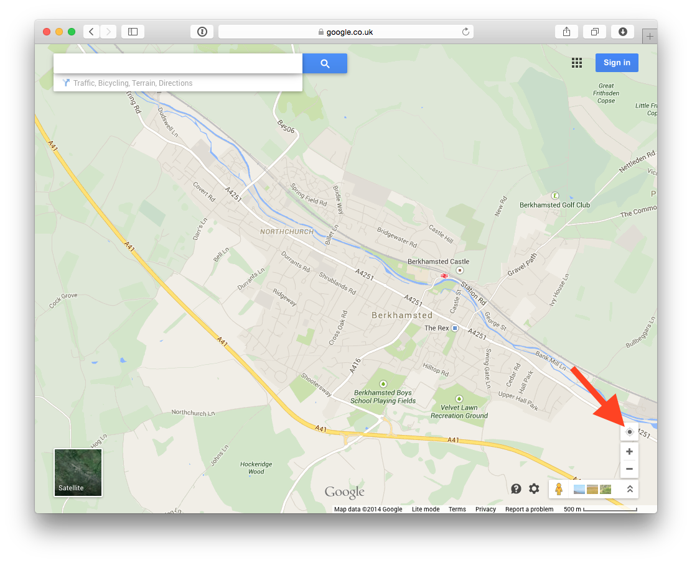
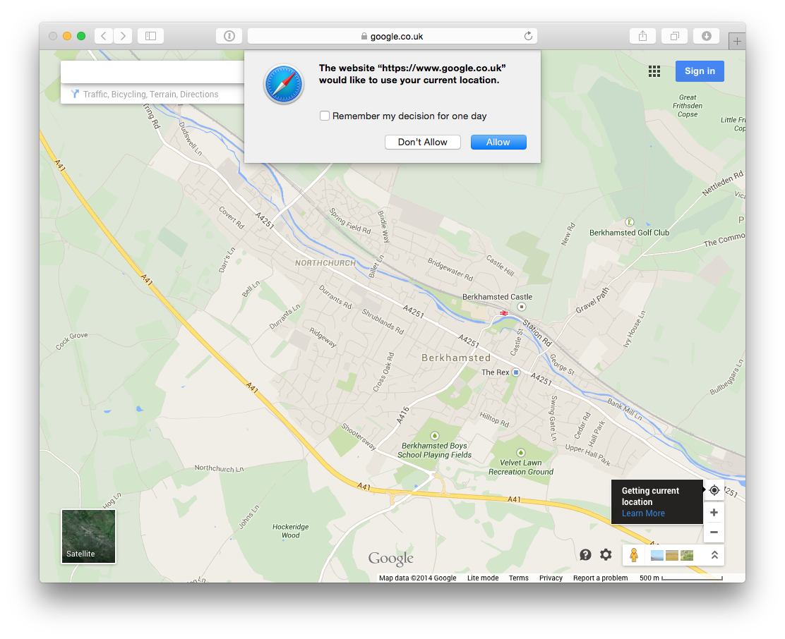
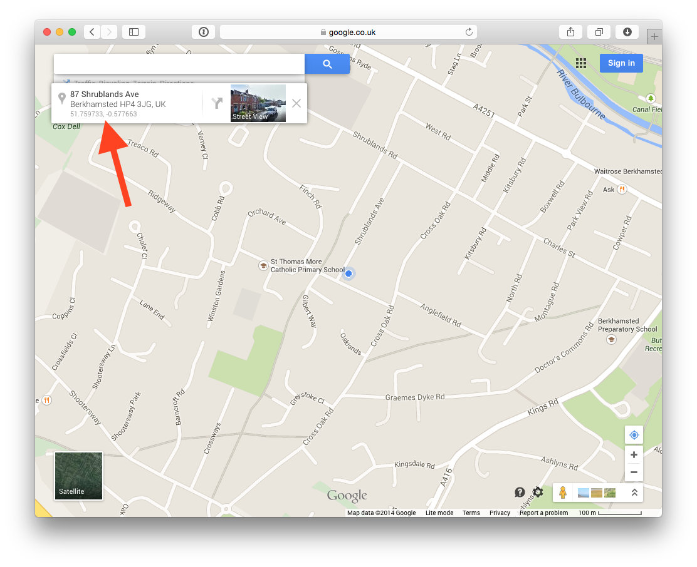

##What if I don't know where I am?

Go to [https://www.google.co.uk/maps](https://www.google.co.uk/maps) and click as shown by the red arrow:



If required, and if you don't mind, authorise Google to query your computer to try find out your location:



Click on the blue dot at the centre of the map and see your coordinates in the box in the top left corner:



You will then call *oa-runner* by specifying:

```
> node oarunner.js --lat=51.759733 --lon=-0.577663 [etc. etc.]
```